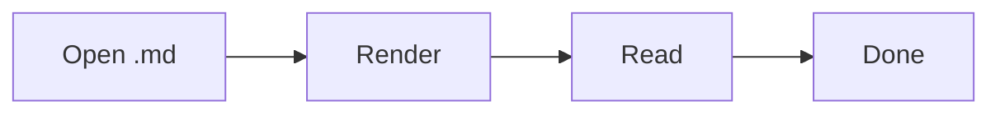
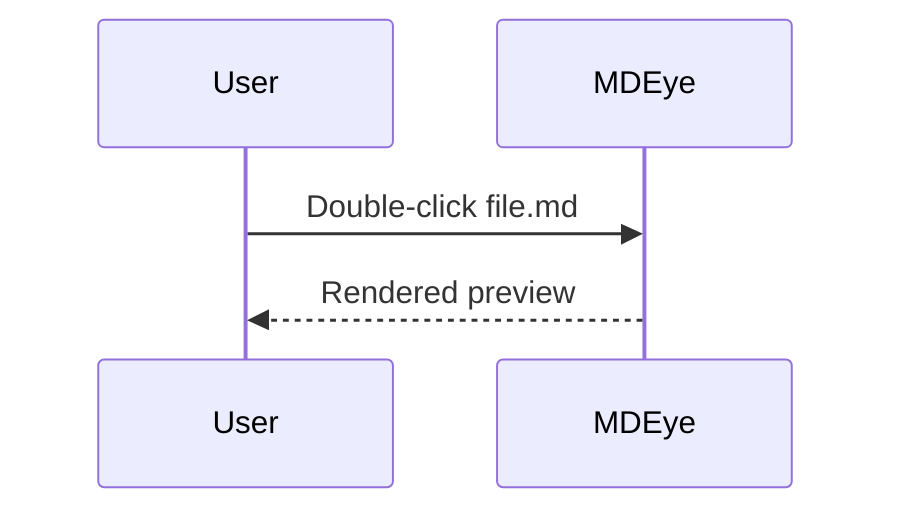

# Hello from fixtures

This is a **sample** Markdown file for MDEye **full** pack.

## Lists

- item one
- item two

### Tasks

- [x] Offline reading
- [x] Mermaid bundled

## Code

```js
function greet(name) {
  return `hello ${name}`;
}
```

## Table

| Feature | Status |
| ------- | ------ |
| GFM     | yes    |
| Themes  | yes    |
| Mermaid | yes    |

## Mermaid




